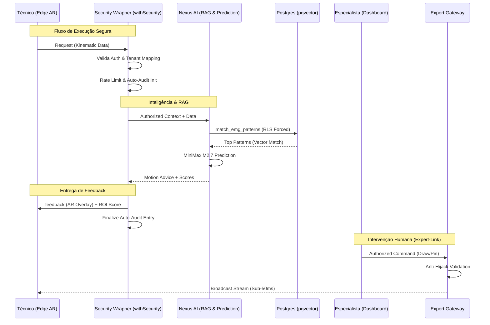

# 🛡️ NEXUS: Relatório Detalhado de Capacidades (Enterprise Map)

Este documento contém a matriz funcional completa do Nexus Physical Intelligence OS, detalhando cada subsistema, o seu objetivo estratégico e o fluxo arquitetural de dados.

---

## 🏛️ 1. Arquitetura Detalhada (Zero Trust Flow)

---

## 📊 2. Matriz de Funcionalidades (Full Inventory)

| Funcionalidade | Categoria | Objetivo Estratégico | Comportamento Técnico (Internal) |
| :--- | :--- | :--- | :--- |
| **`withSecurity` Wrapper** | **Segurança** | Eliminar erro humano e garantir Zero Trust. | Envelopagem de HOF que resolve Auth, Tenant e Audit antes da execução. |
| **Kinetic Engine (ROI)** | **AI / Visão** | Medir a qualidade da execução técnica. | Orthonormal Normalization + Savitzky-Golay + Constrained DTW. |
| **Neuromuscular RAG** | **AI / Dados** | Recuperar destreza técnica em tempo real. | Busca vetorial pgvector com filtragem corporativa automática (HNSW). |
| **Expert-Link Gateway** | **Real-time** | Permitir suporte especialista remoto ultra-rápido. | Proxy de broadcast seguro com validação de pertença organizacional. |
| **Auto-Audit Trail** | **Compliance** | Cumprir o EU AI Act e garantir rastreabilidade. | Registo persistente e imutável de todas as chamadas críticas de API. |
| **Motion Prediction** | **AI Predict** | Prevenir acidentes e erros proactivamente. | Predição T+200ms via MiniMax M2.7 baseada em trajetórias de rede. |
| **Cognitive Adapter** | **AI Logic** | Traduzir dados complexos em voz didática. | Utiliza Gemini para gerar analogias técnicas baseadas no contexto. |
| **Vision Workers** | **Vision** | Garantir performance 60fps em hardware mobile. | Isolamento da inferência Mediapipe em Background Threads (WASM). |
| **Multi-tenant Sentinel** | **Segurança** | Impedir fuga de dados entre organizações concorrentes. | Validação física de ID de empresa no servidor (`enforceTenant`). |
| **Hardware Benchmark** | **Diagnostics** | Assegurar a prontidão operacional do dispositivo. | Teste sintético de latência de tensor e largura de banda de rede. |
| **Blockchain Attestation** | **Confiança** | Notarização de competências para RH e Seguros. | Geração de prova criptográfica de conclusão de skill com alta pontuação. |
| **GDPR TTL Privacy** | **Privacidade** | Minimizar riscos de armazenamento de dados sensíveis. | Política de purga automática de dados biométricos "quentes" após 24h. |
| **Predictive Rate Limit** | **Resiliência** | Proteger o sistema contra abusos e ataques DoS. | Limitação de pedidos inteligente baseada em tokens por ID de utilizador. |

---

## 🏁 3. Resumo de Maturidade Enterprise

| Métrica | Nível | Descrição |
| :--- | :--- | :--- |
| **Blindagem de Dados** | 🟢 **CRÍTICO** | Isolamento total via Iron Shield v5 e RLS. |
| **Conformidade Legal** | 🟢 **TOTAL** | Preparado para EU AI Act, GDPR e Lei 102/2009. |
| **Resiliência de IA** | 🟢 **ALTA** | Dual-model redundancy (MiniMax + Gemini) e RAG local. |
| **Interoperabilidade** | 🟢 **PRONTO** | APIs modulares prontas para integração SAP/Oracle. |

---
**👉 "O Nexus é uma plataforma de Governação de Destreza Humana que transforma movimento físico em dados auditáveis e seguros."**
