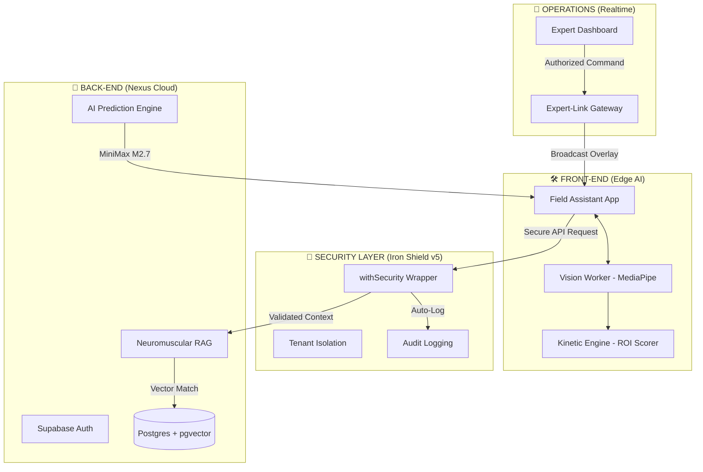

# 🛡️ NEXUS Physical Intelligence OS: System Blueprint

Este documento descreve a arquitetura técnica, os subsistemas e a lógica funcional do **Nexus**, o primeiro Sistema Operativo de Inteligência Física projetado para a era da computação espacial e assistência industrial aumentada.

---

## 🏛️ 1. Arquitetura de Alto Nível (Enterprise Edge-to-Cloud)

O Nexus utiliza uma arquitetura híbrida que equilibra a baixa latência da IA local (Edge) com o poder computacional e a governação da Cloud.

---

## 🧠 2. Camadas de Inteligência Física

### 2.1 Neuromuscular RAG (Retrieval-Augmented Generation)
- **O que faz**: Recupera padrões de movimento de alta precisão baseados em vetores de posição.
- **Funcionamento**: Transforma marcos da mão em embeddings vetoriais e utiliza o `pgvector` no Supabase para encontrar as 3 melhores correspondências (`match_emg_patterns`) dentro do tenant da empresa.
- **Utilidade**: Permite que o técnico receba instruções baseadas na performance real de especialistas.

### 2.2 Motion Prediction (T+200ms)
- **O que faz**: Prevê a trajectória da mão do técnico 200 milissegundos no futuro.
- **Funcionamento**: Utiliza o modelo **MiniMax M2.7** para analisar a tendência cinemática e o contexto RAG, permitindo correções proactivas de erro antes mesmo do erro ocorrer.

### 2.3 Kinetic Engine & ROI Scorer
- **O que faz**: Mede a precisão física da execução (Return on Instruction).
- **Funcionamento**: Compara coordenadas 3D em tempo real. Se o "Score" for > 85%, a etapa é validada. Se cair < 40%, o sistema dispara alertas visuais de risco.

---

## 📡 3. Camada de Operações & Real-time

### 3.1 Expert-Link (Teletransporte AR)
- **O que faz**: Permite que um especialista remoto "veja" através dos olhos do técnico e desenhe anotações espaciais.
- **Funcionamento**: Protocolo de broadcast via WebSockets seguro (Supabase Realtime) com latência < 50ms.

### 3.2 Secure Realtime Gateway
- **O que faz**: Impede que sessões sejam sequestradas.
- **Proteção**: Apenas especialistas validados pelo servidor no mesmo Tenant podem emitir comandos AR para um técnico específico.

---

## 🔐 4. Governação & Segurança (Iron Shield v5)

O Nexus é construído sob o modelo **Zero Trust Enforced**.

### 4.1 withSecurity Wrapper
- **A Barreira**: Nenhum endpoint de API pode ser operado sem passar por este wrapper.
- **Automação**: Resolve identidade, rate-limiting e auditoria de forma atómica.

### 4.2 EU AI Act & GDPR Compliance
- **Audit Logs**: Registo automático de todas as intervenções de IA e humanos na tabela `audit_logs`.
- **TTL Policies**: Dados de telemetria "quentes" são apagados após 24h, sendo mantidos apenas agregados anónimos para analytics industrial.

---

## 🛠️ 5. Subsistemas de Suporte

### 5.1 Vision Workers (Background Inference)
- **O que faz**: Garante 30fps fixos em smartphones.
- **Funcionamento**: Toda a lógica de visão computacional (MediaPipe) corre numa `Background Thread`, deixando a main thread livre para uma UI fluida e responsiva.

### 5.2 Blockchain Attestation
- **O que faz**: Notarização de competências.
- **Funcionamento**: Gera um "Certificado de Skill" digital cada vez que uma competência é completada com Score > 95%, pronto para integração em sistemas de RH/Compliance.

### 5.3 Hardware Benchmark
- **O que faz**: Valida se o dispositivo mobile do técnico é capaz de correr o Nexus com performance aceitável (CPU/GPU/RAM benchmark).

---

## 📈 6. Resumo de Maturidade
O Nexus OS não é apenas uma aplicação de AR; é uma plataforma industrial auditável, segura e escalável, projetada para digitalizar a destreza física humana com **Zero Trust** e **IA Determinística**.
